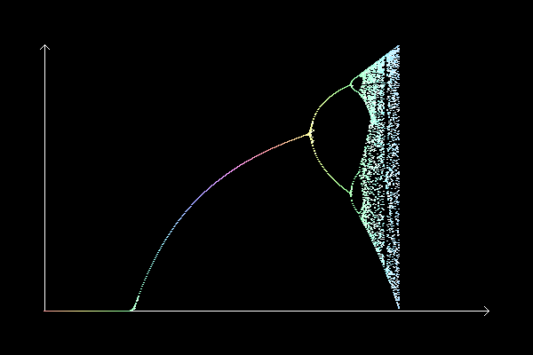

# 第3回： カオス

#### 重要なお知らせ1 レポートの提出方法について

第3回のレポート提出期限は 2023年5月21日 15:15 まで。
#### 重要なお知らせ2 授業・レポートに関する質問について
授業・レポートに関する質問は、TAの相川さん（aikawa@cmu.iit.tsukuba.ac.jp）まで連絡してください。

## 課題
#### 必修課題は全部で2つ（演習1と演習2）

- **演習1. メイのモデルの描画 (2点)**
- **演習2. ローレンツシミュレーションの実装1 (3点)**
- **演習3. 磁石を使ったカオス振り子による描画装置の作成XXX (5点)**
- **ボーナス課題1. これは何をするプログラムでしょうか？ (3点)**

## 0.ちょっとした工夫

#### デバッグしやすいように変数を表示

プログラムを実行してエラーが出たときに、各変数の値を表示させると、スムーズにデバッグできたりします。processingにも、変数を表示させる機能がありますので、この機能を活用してみるとよいでしょう。

**<a target="_blank" href="http://processing.org/reference/println_.html">・printlnコマンド</a>**

#### マウスをクリックすると、画像をキャプチャできるようにする

前回の課題で、「実行結果の画面をキャプチャする」ものがありました。この場合、もちろん、「Print Screen」を使うのもよいですが、以下のコードを利用することで、マウスをクリックすれば、「result.png」に保存されるようになります。拡張子を変更することで、いろいろな形式の画像として保存することができます。
<pre style="background-color: silver; padding: 8px; border-radius: 4px;">
void mousePressed() {
    saveFrame("./result.png");
}
</pre>
これから、たくさん使う機会があるかと思います。よく覚えておきましょう。

## 演習1. メイのモデル　２点

授業中に登場したメイのモデル（ロジスティック写像）を描いてみましょう。

<a href="./map1.txt" target="_blank">メイのモデルの描画プログラム</a>

以下の演習問題の指示に従いレポートを作成しましょう。

**■演習 [2点]**

プログラムの冒頭にあるコントロールパラメータaの最小値と最大値を変更することで、描画範囲を変更することができる。

- 最小値を3.8、最大値を4.0に設定して描画せよ。

- 最小値を3.85、最大値を3.87に設定して描画せよ。

- 最小値を3.855、最大値を3.86に設定して描画せよ。

## 演習2. ローレンツのシミュレーション 1

1961年当時のローレンツの気分を味わいましょう。
当時、ローレンツが使っていたコンピュータはポンコツ同然だったそうです．このような話を聞くと、我々の研究の品質が、お金をかけた周囲の環境で決まるのではなく、本質を見抜く鋭い思考に大きく依存していると、改めて感じませんか？これは、みなさんにとっても、大きなニュースであり、皆さんの手元にあるノートパソコン（あるいはL504は自由に使えるので、そこのパソコンでもよい）を使えば、いくらでもサイエンス級の成果を出すことのできるチャンスがあるということです！がんばってくださいね。

<a href="./lorenz.txt" target="_blank">Lorenzアトラクタの描画プログラムその1</a>

まずは、このプログラムを実行した上で以下の問いに答えてください。

**演習2.[3点]**
このプログラムでは、マウスをクリックする度に初期パラメータが変更され、異なる結果が得られるようになっている。さて、この初期パラメータを、上記のprintlnを使って表示させるようにプログラムを改良せよ．このプログラムを用いて、異なる条件で3種類のシミュレーションを行い、その初期パラメータと画像をセットにしてワードにはりつけ、提出せよ。

## ■課題3 磁石を使ったカオス振り子による描画装置の作成 (5点)

XXX 変更予定？

## ボーナス課題1. これは何をするプログラムでしょうか？

以下のプログラムをダウンロードし、まず実行してみてください。
音が出るプログラムです！スピーカーの音量に十分注意してください！

**■ボーナス課題1.[3点]**
このプログラムは一体何をするプログラムでしょうか？プログラムの解説を、300文字程度で記述しなさい。

<a href="./PlayBifurc.txt" target="_blank"> 謎のプログラム</a>
