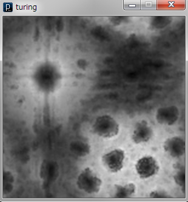
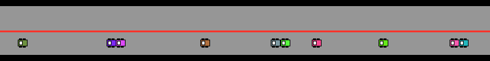

# 第4回： セルオートマトン

## 課題について

第4回のレポート提出期限は 2025年05月26日 15:15 まで。

#### 必修課題は全部で4つ（演習1、演習2、演習3、演習4）。選択課題は1つ以上。

- 演習1. 1次元セルオートマトンの実装 (2点)
- 演習2. 1次元セルオートマトンの実装（インタラクティブ） (2点)
- 演習3. 2次元セルオートマトンの実装 (3点)
- 演習4. セルオートマトンのハードウェア実装への挑戦（5点）

#### 選択課題（どれも5点）

- 選択1. 拡散反応系の実装 (5点)
- 選択2. 高速道路シミュレータの実装（5点）
- 選択3. バスシミュレータの実装（5点）

## 1. 1次元セルオートマトンの実装

まず最初に、1次元セルオートマトンを実装してもらいます。セルオートマトンのプログラムについては、実は、Processingのサンプルプログラムとして提供されています。ただし、そのプログラムはわかりにくいと思いますので、以下に、わかりやすいコメントを記入したものを準備しました。まずは、これをコピー＆ペーストして実行し、理解を深めてください。

<a href="sis04_1dca_1.pde" download="sis04_1dca_1.pde" target="_blank"><u>1次元セルオートマトンのプログラム</u></a>

###### プログラムの解説と練習問題

ここで実装する1次元セルオートマトンは、2状態3入力1出力のものである。つまり、「白か黒」、あるいは「1か0」のどちらかの状態をとるセルから構成され、注目セルの両隣セルを注目して、次の状態を決めるセルオートマトンです。

**練習1.**

遷移ルールの定義を変化させて、セルオートマトンのふるまいを調べてみよう。つまり、遷移ルールの定義部分

**int[] ruleset = {0,1,0,1,1,0,1,0};**

を、色々と変化させてみましょう。

**練習2.**

授業で紹介したルール184を実装し、交通流を模擬しているかどうか確認しましょう。

#### 各種機能の追加

上記サンプルプログラムでは、状態遷移ルールをいちいち設定しなおさなければならないので、これは大変な手間ですね。以下のような機能を追加することにします。

- 機能1 画面一番下まで描画を完了したら、次の状態遷移ルールにセットしなおす
- 機能2 状態遷移ルールは、最初ルール0からスタートし、255まで増加する
- 機能3 マウスを押すと、同じルールで、異なる初期状態からセルオートマトンを計算しなおす

この3つの機能を追加した、強化プログラムを以下に準備しました。これについて理解を深めてみましょう。

<a href="sis04_1dca_2.pde" download="sis04_1dca_2.pde" target="_blank">機能追加版 プログラム</a>

- ※1. 最初のルール0あたりは、あまり動きがないので注意。そのうち活発に動くようになります。
- ※2. println文などを使って、現在の状態を表示させるように工夫するとよいですね。

###### 演習1. [2点] クラス1〜4を生成するルールを、各クラスに対し1つずつ見つけて、それらの実行結果を貼り付けたものを提出してください。つまり、最終的にはルール4つ、実行結果の画面4つを提出してもらうことになります。

## 2. 1次元セルオートマトン（インタラクティブ）

<a href="processing_CA_interactive.pde" download="processing_CA_interactive.pde" target="_blank">1次元セルオートマトンのインタラクティブバージョンのプログラム</a>をダウンロードして、実行してみてください。

###### ■演習2. [2点]

上記に示す1次元セルオートマトン（インタラクティブ）を、自分なりに改造してみてください。その改造したプログラム、および改造のポイントを説明したワードファイルおよび結果のスクリーンショットをまとめて、提出すること。

## 3. 2次元セルオートマトン

授業中に紹介したライフゲームを実装してみましょう。ライフゲームについても、実は、Processingのサンプルプログラムとして提供されていますが、理解しやすいように、以下のコメント付きのプログラムを準備しましたので、こちらを参考にしてください。

<a href="sis04_2DCA_1.pde" download="sis04_2DCA_1.pde" target="_blank">2次元セルオートマトン</a>

上記のプログラムでは、ちょっと面白くないので、フェード効果（画面全体を薄い色で塗りつぶす）を取り入れたプログラムを準備しました。少しロマンチックになるのではないでしょうか？

<a href="sis04_2DCA_2.pde" download="sis04_2DCA_2.pde" target="_blank">ロマンチックバージョン</a>

###### 演習3. [3点] 相互作用の部分を自分なりに調整し、興味深いふるまいを行う2次元セルオートマトンを作ってみてください。興味深い発見ができなくても、自分なりのものであればオッケーです。

※1.実行結果、2.プログラム、3.工夫した点の説明をまとめ、PDFファイルにして提出すること。

## 4. セルオートマトンのハードウェア実装への挑戦

###### 演習4. [5点] 授業中に紹介した歯車計算機のようなイメージで、例えば、セルオートマトンをハードウェアとして実装しようとしたら、皆さんは、どのようなハードウェアを設計しますか？ 　。自由に発想し、それをPDFファイルにして提出すること。（他のメンバとの協力はせずに、必ず1人でアイデアを出してください）。また、ハードウェアとしての実装が難しい場合には、 どこが最大の阻害要因となっているのかを説明すること。

#### 以下、3つの選択演習課題を準備しています。どれも得点は同じです。いずれか1つを選択して提出してください。もちろん、3つ選択して提出してもらっても結構です。その分、加点します。

## 選択演習課題1. 反応拡散系シミュレータの解析 (5点)

選択課題1では、反応拡散系シミュレータ（Jonathan McCabe氏が作成したもの）の解析を行ってもらいます。プログラムを実行すると以下のような綺麗な拡散する模様の映像が出てきます。

<a href="turing.pde" download="turing.pde" target="_blank">反応拡散系シミュレータのプログラム</a>

###### ■選択演習課題1. [5点]

このプログラムでは、キーボードから「r」「p」「c」「b」「i」「s」「+」「-」あるいはカーソルキーの「上下右左」を入力することで、制御することができます。さらにマウスを使ってインタラクションすることも可能です。

では、このプログラムは一体、どのような動きをしているのかを、プログラムを解読して、簡単な説明書（500文字程度で結構です）を作りなさい。（このプログラムが何をシミュレーションしようとしているのか、また上記のキー操作で、どのようなパラメータが操作されるのかなど、簡潔に説明すること）

## 選択演習課題2. 交通流シミュレータ「ながれさん」(5点)

選択課題2では、交通流シミュレータという、現実世界を模擬したシミュレータを作成してもらいます。

■まずは、「追い越しのできない」シミュレータに挑戦してみましょう。

<a href="nagare_1.pde" download="nagare_1.pde" target="_blank">追い越しのないバージョンプログラム</a>

「ながれさん」（追い越しのできないバージョン）の実行結果

どうでしょうか？うまく動きましたか？ 多少、交通渋滞の様子が模擬できているのではないでしょうか？

###### 選択演習課題2-1. [1点]

途中に信号機などを取り付けてみると、さらにリアルなシミュレータになります。また、自動車の台数、スピード等を変化させるとさらに興味深い結果になると思います。これらを実現してみてください。

###### 選択演習課題2-2.[2点]

このシミュレータに「サグ部」を設定し渋滞が発生する様子を実現してください。

**これらを実装したプログラムおよび実行画面をキャプチャしたものをワード等に貼り付けて提出してください。**

#### ■つぎに、「追い越しのできる」シミュレータに挑戦してみましょう。

注意してほしいのは、このプログラムは、衝突判定がかなりイイカゲンです。皆さんの教育のためを思って、わざとイイカゲンなプログラムにしてあります。本当です。できる人は、このプログラムの衝突判定部分を、しっかりと作りこんでみましょう。

<a href="nagare_3.pde" download="nagare_3.pde" target="_blank">追い越しのできるバージョンプログラム</a>

「ながれさん」（追い越しのできるバージョン）の実行結果

###### 選択演習課題2-3.[2点] 上記、信号機とサグ部を両方実装したプログラムを用いて、以下の現象を解析して、レポートしてください。

- 1) 任意の2台の車の色を赤色に、その他のすべての車の色を青色に指定してください。
- 2) 上記の2台を、全く同じ性能を持つようにし、ほぼ同じ位置から出発させたとき、その挙動はどうなりますか？例えば、タイミングによっては、信号待ち等の影響で、この2台に圧倒的な差ができてしまうでしょうか？
- 3) 上記の2台のうち、1台を普通の性能、もう1台をやや速めの性能にして、ほぼ同じ位置から出発させてみてください。その挙動はどうなりますか？やや速めの車の方が圧倒的な差をつけるでしょうか？それとも、そうでもないでしょうか？

※よくネット上で

「時速60kmと時速80kmの自動車２台が同時に大阪を出発して一般道のみで東京を目指した際、
所要時間の差は20分ほどしかなかった」という話を聞いたことがあるのですが、本当でしょうか？

といった疑問に答えるサイトがありますが、上記の3)のシミュレータを使えば、そんな疑問に対して簡単に解決できる？（と思われます）。

## 選択演習課題3. バス停シミュレータ「一徹」（Ittetsu）(5点)

選択課題3では、バス停シミュレータ「一徹」に取り組んでみましょう。以下に、サンプルプログラムがありますので、まずはそれを実行させてみてください。平和に時間がながれ、バスも平和に動いていますね。

<a href="ittetsu.pde" download="ittetsu.pde" target="_blank">バス停シミュレータ</a>

###### 選択演習課題3.[5点]

このサンプルプログラムを実行し、ある程度時間が経過すると、複数台バスが連結するようになっていると思います。この現象がもっと、はっきりと出るように改良してみてください。

また、バスが複数台連結してしまう現象を解決する方策を盛り込んで、シミュレータを実装してください。難易度が高いと思いますが、がんばってください。

プログラム、実験結果、考察を含めてレポートしてください。

Copyright © Hajime Nobuhara, All Rights Reserved.
