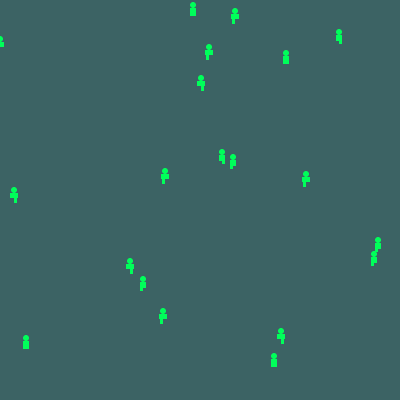
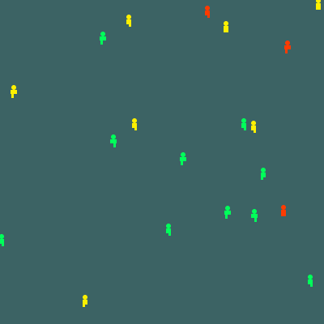
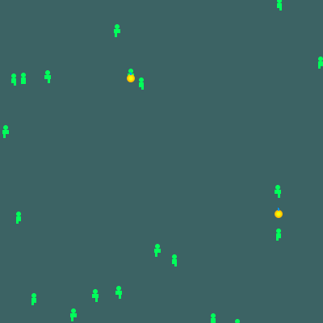
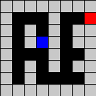

# 第7回： マルチエージェント

## 課題について

第7回のレポート提出期限は 2024年06月17日 15:15 まで。

#### 必修課題は全部で2つ（演習1と演習2）。ボーナス課題は1つ（演習3）
- 演習1.マルチエージェントシミュレータ (5-10点)
- 演習2. boidシミュレータ (7点)
- ボーナス課題1. TD学習の実装 (+10点)

## 1. はじめに (introduction)
今週はProcessingを使って、人工社会シミュレータを実現します。最初は、ごく簡単な機能を持つエージェン トをシミュレータ内に配置します。このシミュレータそしてエージェントに対し、時間の概念や捕食の概念、さらには生死の概念を導入し、どんどん複雑な人工社会を構成してゆきます。

今回のシミュレータでは、個々のエージェントのふるまいが、 全体の社会環境に対して影響し、さらに社会環境から個々のエージェントに対し影響が及ぶという、ミクロマクロループの概念を明確に示してくれると思います。しっかりと、その様子を学び、自分なりの理解に向けて、がんばってください。

## 2. 人工社会シミュレータ イチロー君

人工社会シミュレータ 「イチロー君」では、画面内にエージェントを複数登場させ、それぞれが互いにぶつからないように動き回る機能を搭載している。このシミュレータが、今回のコアになるので、よく理解してください。

<a href="human1.pde" download="human1.pde" target="_blank">人工社会シミュレータ イチロー君</a>

人工社会シミュレータ イチロー君 実行の様子

##### 練習1

- 1-1. エージェントの数を増やしてみましょう。
- 1-2. エージェントの色や形状を変化させる、など、味付けをしてみましょう。

## 3. 時間の概念および生死の概念の導入
さきほど作成したイチロー君に、時間の概念と生死の概念を導入した「ジロー君」に挑戦してみましょう。

<a href="human2.pde" download="human2.pde" target="_blank">人工社会シミュレータ ジロー君</a>

##### 練習2

2-1. 各エージェントの体力の減少とともに、移動スピードが遅くなるように工夫してみよう。

## 4. 捕食の概念の導入 (food problem in the simulator)

ジロー君に、捕食（食べ物を獲得する機能）の概念を導入した「サブロー君」に挑戦してみましょう。

※各エージェントの動きがぎこちないかもしれません。自分なりにチューニングしてみてください。

<a href="human3.pde" download="human3.pde" target="_blank">人工社会シミュレータ　サブロー君</a>

##### 練習3

- 3-1. 食べ物の発生頻度を変化させてみましょう。
- 3-2. 食べ物を獲得した場合の体力の上昇を調整してみましょう。

## 5. 課題その1  [5-10点]
どれか1つでよいです。もちろんすべて満たすとうれしいですね。

条件1. 季節（春夏秋冬）の概念を導入し、季節によって食物の発生頻度を変化させる機能

条件2. 各エージェントの体力が、ある一定値以上になったら増殖する機能

条件3. 2種類のエージェントを存在させ、異なるエージェント同士がケンカし、体力が減少する機能

条件を複数満たした場合には、加点しますので、どんどん挑戦してください。

※画面をキャプチャしたもの、ソースコードをあわせて、提出してください。もちろん、考察もつけてください。

条件1〜3を満たしたシミュレータの結果画面

各エージェントに、たとえば、同じ種族ならば助け合う機能、食物を保存する機能、味方同士で集まる機能、などなど、本当に考えればキリがないくらい面白い作りこみが可能だと思います。また、種族を同じシミュレータ内に共存させることが非常に難しいことも、きっとわかってもらえると思います。ぜひ、自主制作課題などで、これらのシミュレータを発展させたものなどに挑戦してみてください。

## 6. 課題その2 [5点+2点]

ここにBoids（Flocking）という動物の群れの動きを参考にして、i)周りに方向を合わせる ii)ある一定以上周りと距離を取る iii)群れを見つけるとその群れに加わるという3つのルールに従い、周りのエージェントの状態によって自分の行動を決めるというマルチエージェントの一種があります。

https://processing.org/examples/flocking.html

このシステムに以下のいずれかの機能を追加してください

- 1)目標地点に向かって動く、とどまるような機能(2点）
- 2)壁などの障害物を設置しそれを避けるようにする機能（3点）
- 3)その他自分の提案した機能（2点）

すべて実装してもらってもかまいません。実装した機能に関しての詳しい説明および実行結果の画面をキャプチャして、wordファイルにまとめて提出してください。

## 7. 課題その3（ボーナス）[10点]

授業中に紹介したTD学習などを使って、実際に迷路を最短距離で走り抜けるプログラムを作りなさい。TD学習に固執する必要はありません。強化学習の要素、すなわち遅延報酬と試行錯誤的な要素が入っていればOKとします。以下の図のような、単純なもので結構です。下の図、そっくりそのまま作る必要はなく、自分自身で適当にアレンジしてもらって結構です。

この迷路は8×8のブロックで構成されていて、青が冒険者、赤がお宝を意味しています。報酬の与え方や学習係数などは皆さん独自に設定してください。皆さんの素晴らしいプログラムを期待しています！

Copyright © Hajime Nobuhara, All Rights Reserved.
